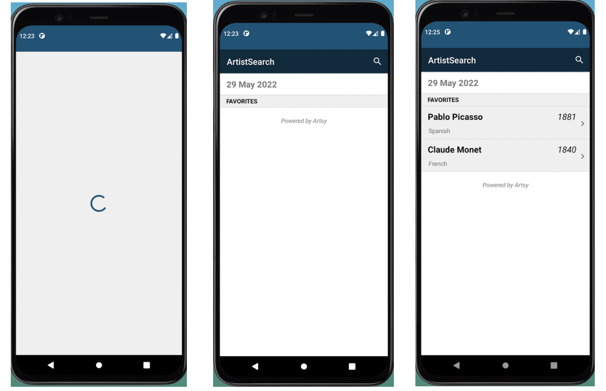
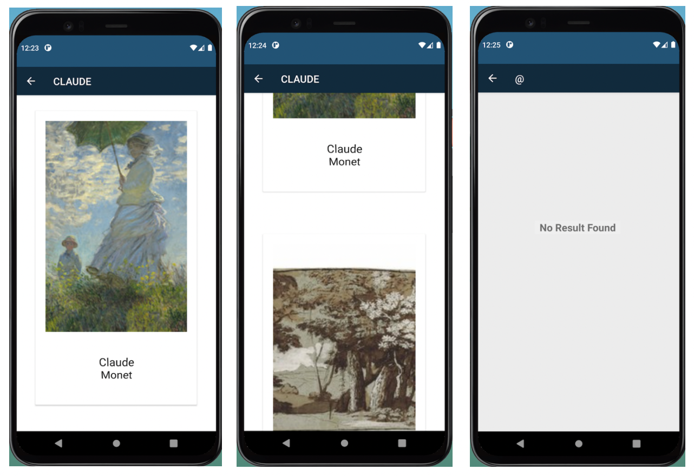
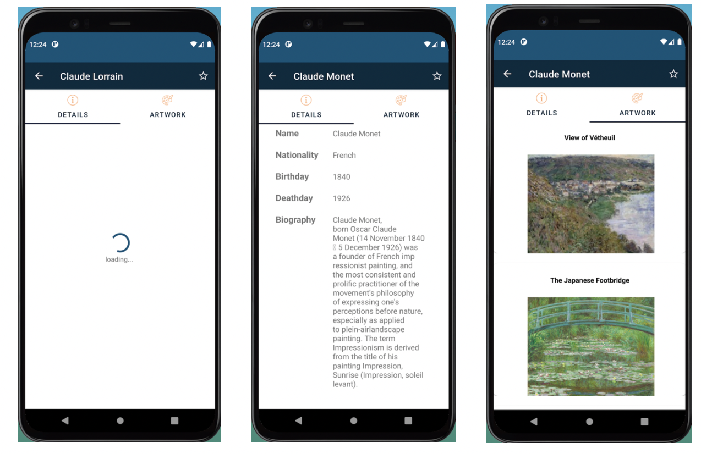
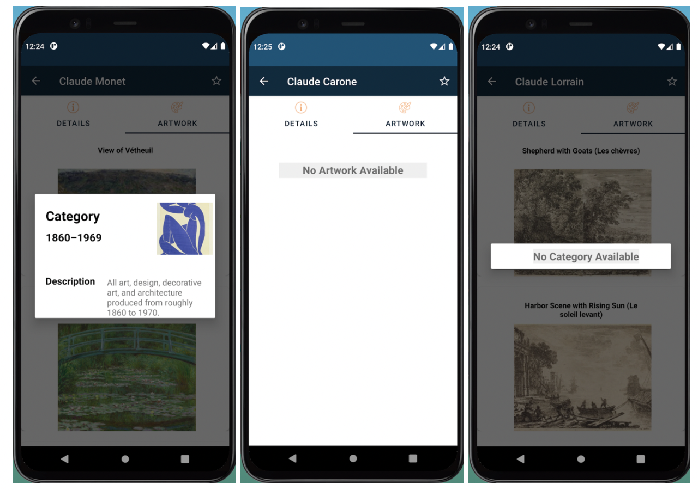

# Artist Android App

 This project develop an Android application, which allows users to search for different artists and look at the detailed information about them. Users can also save their favorite artist to view them or track their artworks. The App contains 3 screens: Home screen, Search Result screen and Detailed Artist Information screen. However, the App has multiple features on each of these screens.This app has been designed and implemented in a Pixel 5 emulator by using SDK API 30 in Android Studio.

## Project Goals

- Become familiar with Java, JSON, [Android Lifecycle](https://developer.android.com/guide/components/activities/activity-lifecycle) and [Android Studio](https://developer.android.com/studio) for [Android app development](https://www.android.com/)
- Build a good-looking Android app
- Learn the essentials of Google’s Material design rules for designing Android apps
- Learn to use the tiingo APIs and the Android SDK
- Get familiar with third party libraries like [Picasso](https://square.github.io/picasso/), and [Volley](https://developer.android.com/training/volley)
- Understand the flexible [Gradle](https://gradle.org/) - based build system
- Define commonly used [layouts](https://developer.android.com/guide/topics/ui/declaring-layout) for building the UI
- Implement [Autocomplete](https://developer.android.com/reference/android/widget/AutoCompleteTextView) feature for searching stock tickers
- Implement [swipe and drag](https://developer.android.com/reference/androidx/recyclerview/widget/ItemTouchHelper) feature, and move items in a recyclerview
- Use [webview](https://developer.android.com/reference/android/webkit/WebView) to run javascript inside mobile

## Preview

**Home Screen**

**Search Result Screen**

**Detail Artist Infomation Screen**

**Other Screens**

